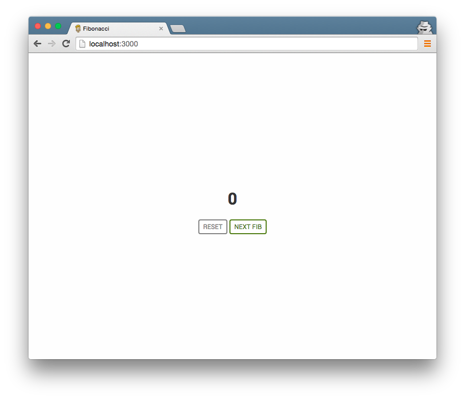

## Fibonacci's Button


The Fibonacci Sequence is an integer sequence commonly used in places where increasing sequences are needed, like login throttling or coding interview questions :smile:. Formally it's defined as:

```
fib(n) = fib(n-1) + fib(n-2)
```

For this exercise we'll use the following base cases:
```
fib(0) = 0
fib(1) = 1
```


### What do I do?

This is a simple test of basic CS fundamentals as well as basic Angular knowledge. The spec is as follows:

- [ ] A single page that contains two buttons, `Reset` and `Next Fib`, as well as the current value of the sequence interpolated above it, starting at 0.
- [ ] When the `Next Fib` button is clicked, we will update the view to display the next step of the sequence.
- [ ] Clicking the `Reset` button will reset the sequence to the base case
- The buttons and text should be styled similarly to the screenshot below:


### For consideration:

- Don't worry too much about dependency management. Including angular in a `<script>` tag is fine for this example.
- Performance is important here. Make sure to watch how frequently you're evaluating a `fib()` function such that you're only running it as needed.
- Update the last section of this `README.md` with any thoughts or explanations you may have.
- You can choose to use recursion or iteration for your implementation, but please let us know why you chose the one you did in the README.

### Extra Credit

- Two `Next Fib` buttons, one that uses an iterative Fibonacci algorithm, and another that uses a recursive one, labeled appropriately.
- Automated tests included for the project. Use your framework of choice for testing and include dependencies such that we can run the tests here.


### Solution Discussion:
-I opted to write both a recursive and iterative solution. 
-Both the iterative and recursive solutions share and array of calculated values.
-Given the nature of 'stepping' through the Fibonacci it seemed inefficient to let an either solution go through all their steps when I should already have the previous values calculated.
-Once either approach has calculated the value at N, it is saved and referenced instead of calculated moving forward.
-This saving of data is a clear time saver, especially for recursion which lags on large values of N.
-There is however a problem in my opinion. Because we save the sequence as its calculated the iterative and recursive functions will never need to run through their full algorithms. 
-This is true to the point where the iterative fib_at_n function is never even called and the recursive fib_at_n function never needs to go more then 1 level deep.
-This means that the recursive and iterative solutions may not be the best approach. 
-I wrote them as proof of concept and to complete the challenge but I took a different approach for the solution I'm most happy with.
-When possible I prefer short, clean, and easy to understand pieces of code.
-My personal approach simply looks at the current value and the saved last value, and calculates the next value.
-While this solution has to recalculate the next value each step, it won't have to recalculate every value on every step like a simple recursion or iteration would.
-This solution is more space efficient, shorter and simpler, while still being O(1) for each step.

-I also included test cases for this project. Using Karma and Jasmine I have a suite of simple test cases that can be run from the command line with:
-To run through command line use 'karma start my.conf.js --log-level debug --single-run'
-To run through Chrome simply use 'karma start my.conf.js' 